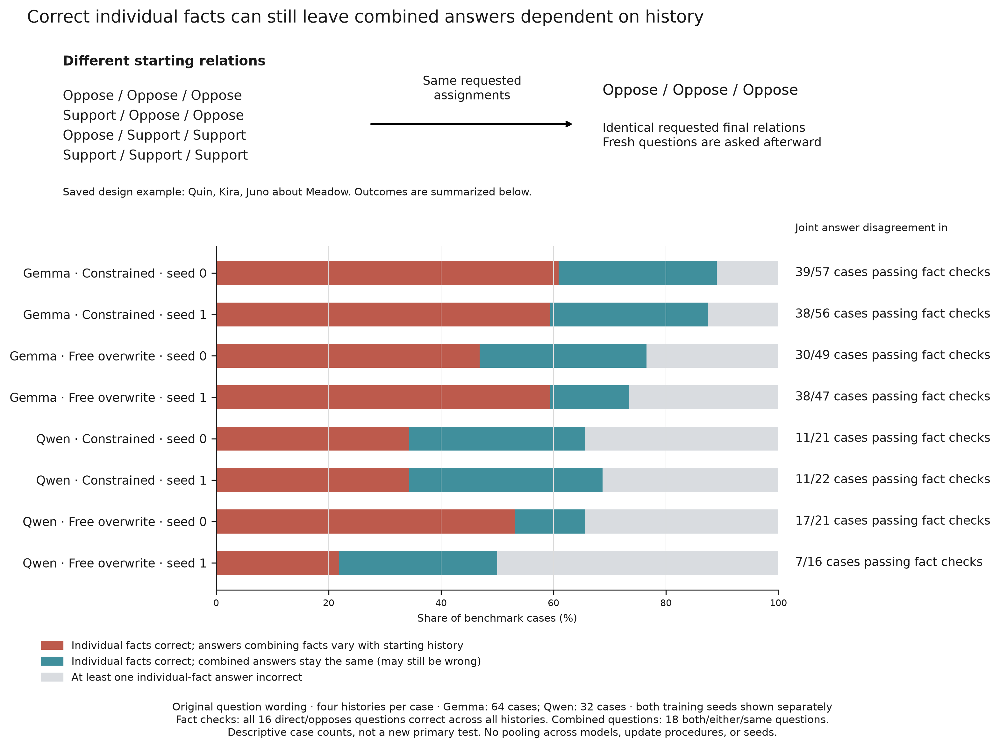

# Figure captions

Main-paper captions; exact procedures, numerical detail, and artifact links are
in the [figure methods and evidence appendix](CAPTION_DETAILS.md).

## Scope

The five representation figures report development evidence about linear
readouts in Llama and Gemma. Later figures test interventions and downstream
behavior. Each study has its own qualifications and outcomes.
See the [results page](../docs/RESULTS_AND_CLAIMS.md).

## Shared definitions

A consideration can support an action in one situation and oppose it in another.
The representation tests pair situations and considerations so that these labels
reverse. This design is called a checkerboard.

The interaction score measures separation that depends on the combination of
situation and consideration. Fixed preferences for either input cancel out.
Scores are expressed in selection-split standard deviations. The evaluation set
contains 125 checkerboards (500 rows), held separate from fitting and layer
selection. These are development data.
[Exact definitions and splits](CAPTION_DETAILS.md#shared-definitions).

## Figure 1: Decodability across layers

The support/opposition relation becomes linearly decodable in later layers.
We fit a separate readout at each layer and evaluate all layers on the same
paired situations and considerations.

Panels **(a, b)** show contextual separation. Panels **(c, d)** show AUROC.
Llama is on the left and Gemma on the right. Both models rise from chance-level
early readouts to a later plateau. The red lines mark layers selected on
separate data.

[Methods and evidence](CAPTION_DETAILS.md#figure-1-decodability-across-layers).

## Figure 2: Scorers at the selected layer

The support/opposition readout separates the relation labels more strongly than
the text-only comparator. We evaluate both on the same paired situations and
considerations.

Panel **(a)** shows Llama and **(b)** shows Gemma. The figure also includes a
logistic activation probe and the model's answer margin. The direction's
advantage over the text comparator has an interval above zero in both models.
Error bars are 95% normal intervals using dyadic-robust standard errors.
The text comparator retains a small positive signal.

[Methods and evidence](CAPTION_DETAILS.md#figure-2-scorers-at-the-selected-layer).

## Figure 3: Checkerboard interaction against the permutation null

The observed relation signal exceeds the randomized-label baseline.
We randomly reverse support/opposition labels by training situation.
The examples and situation groups stay fixed.
We refit the readouts and evaluate them on the unchanged checkerboards.

Grey histograms show densities of randomized interactions.
Colored lines mark the observed values.
Panels **(a, c)** show Llama and **(b, d)** show Gemma.
The top row uses the direction and the bottom row the logistic probe.
All four one-sided tests give p < 0.05.
Gemma's smaller permutation sample gives coarser p-values.

[Methods and evidence](CAPTION_DETAILS.md#figure-3-checkerboard-interaction-against-the-permutation-null).

## Figure 4: Factual True/False positive control

Both models pass the factual-truth control.
We use statements with known truth values and reverse which neutral answer
symbol means True or False.
We then test transfer to a held-out answer format.

Panel **(a)** shows the development layer sweep under both mappings.
Panel **(b)** shows held-out True-minus-False separation in training-projection
standard deviations.
Error bars are 95% group-bootstrap intervals.
Gemma's open marker shows the retained point estimate without an interval.
The later-layer divergence between mappings shows residual answer-format sensitivity.

[Methods and evidence](CAPTION_DETAILS.md#figure-4-factual-truefalse-positive-control).

## Figure 5: Specificity

The relation readout retains a large point estimate under new answer wording.
We keep the evaluation examples and measurement scale fixed.
Panels **(a, b)** show Llama and Gemma.

The relation band compares the original and held-out answer templates.
The baseline band shows text-only scores and arbitrary per-item scores.
Separate-input scores give zero because the interaction cancels additive effects.
Error bars are 95% normal dyadic-robust intervals.
Open transfer markers show point estimates without retained intervals.
These controls test wording and answer format.

[Methods and evidence](CAPTION_DETAILS.md#figure-5-specificity).

## Figure 6: Direct answers and broader counterfactual consequences

Whole-state interpolation recovers downstream consequences much better than
relation-direction steering.
We tune both interventions to the same direct-answer margin in 96 Gemma contexts.
The comparison target comes from changing the relation in the text.

Both interventions hit their requested margin in 100% of contexts (left).
The right panel measures recovery of the changed context's other answers.
A full changed-state patch provides an untuned reference.
Recovery is zero for the unchanged state and one for the natural change.
Negative values move farther from that answer pattern.
Error bars are 95% bootstrap intervals over contexts.
Hitting the target margin did not satisfy the study's stricter qualification requirements.

[Methods and evidence](CAPTION_DETAILS.md#figure-6-direct-answers-and-broader-counterfactual-consequences).

## Figure 7: Correct current facts can still leave downstream answers dependent on source history

Some downstream answers differ across histories even when current facts are
read correctly.
Different starting histories receive the same updates and reach the same
intended current facts.
We then ask the same downstream question through the same response interface.

Panel **A** shows the design.
Panel **B** gives prospective results for Gemma and Qwen under two learned and
two text-based update methods.
We count differing valid answers only when every history reports the required facts
correctly and reference answers are also correct.
Each condition uses 64 cases.
Rates count qualifying cross-history disagreements over all scheduled questions.
Questions failing the checks stay in the denominator.
All eight multiplicity-adjusted 99.375% case-bootstrap intervals lie above zero.
The conclusion concerns behavior in these generated cases.

[Methods and evidence](CAPTION_DETAILS.md#figure-7-correct-current-facts-can-still-leave-downstream-answers-dependent-on-source-history).

## Figure 8: Swapping later activations changes the joint answer

Swapping later stored activations shifts the answer toward the history supplying
them.
In this selected Gemma example, both histories end with Dion and Orla supporting
Bridge.
We combine early activations from one history with later activations from the
other before asking whether both support it.
Model weights stay fixed.

Bars show normalized Yes probabilities under the main answer format.
Adjacent columns show that both direct fact answers remain correct.
Colors identify the later-layer source.
The effect is format-sensitive across the selected examples.

[Methods and evidence](CAPTION_DETAILS.md#figure-8-swapping-later-activations-changes-the-joint-answer).

## Figure 9 - Changing the later stored activations changes the downstream answer

The activation-swap effect appears under both tested answer formats.
One retrospectively selected Gemma pair has matching update counts and prompt
lengths.
Both histories end with Ada and Gita opposing Theater.
We swap later stored activations before asking whether either person supports
it.
The correct answer is No.

Under both formats, the answer follows the history supplying the later
activations.
Direct-fact answers remain correct after the swap.
Bars show normalized Yes probabilities.
Coded answers are mapped back to Yes/No for each question.
Both formats test the same selected example.

[Methods and evidence](CAPTION_DETAILS.md#figure-9---changing-the-later-stored-activations-changes-the-downstream-answer).

## Figure 10. Update procedures and downstream coherence

Learned updates improve complete-case accuracy clearly in Qwen, with mixed
results in Gemma.
We compare two learned procedures with attempted fact refresh plus a textual
correction on the same 64 cases per model.
A case succeeds only when all 34 questions are correct under every starting history.

Panel **A** shows percentage-point changes from the baseline.
Both Qwen intervals exclude zero.
Gemma's intervals touch or cross zero.
Panel **B** shows absolute success.
Neither learned method reaches half the cases on average across seeds.
Error bars are 98.75% paired case-bootstrap intervals.
Triangles show separate seed effects.
The baseline often used its fallback, so the gains apply to that executed procedure.

[Methods and evidence](CAPTION_DETAILS.md#figure-10-update-procedures-and-downstream-coherence).

## Supplementary Figure S1: Broader single-edit training and later sequences

Broader training improves performance on later edit sequences in three of four
comparisons.
Both editors train on individual edits.
The broader condition learns from more consequences of each edit.
We compare them on the same evaluation situations after two or three updates.

Each row shows broader minus narrower training for one editor and model.
Success requires every question about the resulting program to be correct.
Each situation's score averages success after two and three updates.
Dots average both training seeds within each situation.
Triangles show the separate seed effects.
Error bars are 98.75% paired situation-bootstrap intervals.
The comparison uses 64 Gemma situations and 32 Qwen situations.
Gemma's free-overwrite interval crosses zero.
These are relative gains against narrower training.

[Methods and evidence](CAPTION_DETAILS.md#supplementary-figure-s1-broader-single-edit-training-and-later-sequences).

[original comparison table](../reproducibility/relational_editing/v4/expected/T10_coverage_contrasts.csv) · [plot data](../artifacts/figures/editing_comparisons.json)

## Supplementary Figure S2: Changing how the same edited state is queried

The figure compares question wordings on the same saved edited states.
One version paraphrases the question.
Another states the rule for deciding whether two people take the same side.
We measure same-side accuracy after a three-edit sequence.

None of the corrected intervals establishes an improvement.
Several lie below zero.
Error bars are 99.375% paired situation-bootstrap intervals, averaging the two
original training seeds.
The comparison uses 64 Gemma situations and 32 Qwen situations.
Intervals crossing zero leave the direction of the effect unresolved.

[Methods and evidence](CAPTION_DETAILS.md#supplementary-figure-s2-changing-how-the-same-edited-state-is-queried).

[paired scene records](../reproducibility/relational_editing/v6/scores/reader_paired_contrasts.json.gz) · [exact reader prompts](../reproducibility/relational_editing/v6/data/READERS.json) · [plot data](../artifacts/figures/editing_comparisons.json)

## Supplementary Figure S3: Descriptive history dependence in archived cases

Some cases retain history-dependent joint answers despite correct direct-fact
answers across every history.
The top panel shows four starting states receiving the same final assignments.
The bottom panel counts outcomes across all 64 Gemma cases and 32 Qwen cases.
These are descriptive counts from earlier saved experiments.

Red marks cases with correct direct facts but differing joint answers.
Teal marks cases with correct direct facts and stable joint answers.
Gray marks failures of direct-fact checks.
Bars use all cases as their denominator.
Right-hand counts use only cases passing every direct-fact check.
Stable joint answers can still be wrong.

[Methods and evidence](CAPTION_DETAILS.md#supplementary-figure-s3-descriptive-history-dependence-in-archived-cases).

[original PNG](supplementary/figS3_v6_source_history.png) · [original PDF](supplementary/figS3_v6_source_history.pdf) · [Case statistics](../reproducibility/relational_editing/v6/scores/source_root_statistics.json.gz) · [synthetic source worlds](../reproducibility/relational_editing/v6/data/gemma_source_roots.jsonl) · [unchanged plot data](../artifacts/figures/consequence_comparisons.json) · [the archival plotting code](../src/repro/consequence_figures.py)
