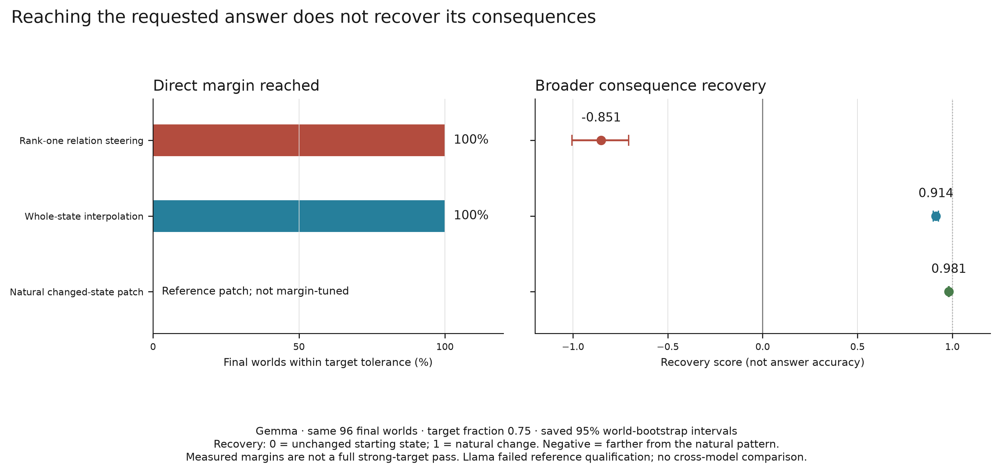
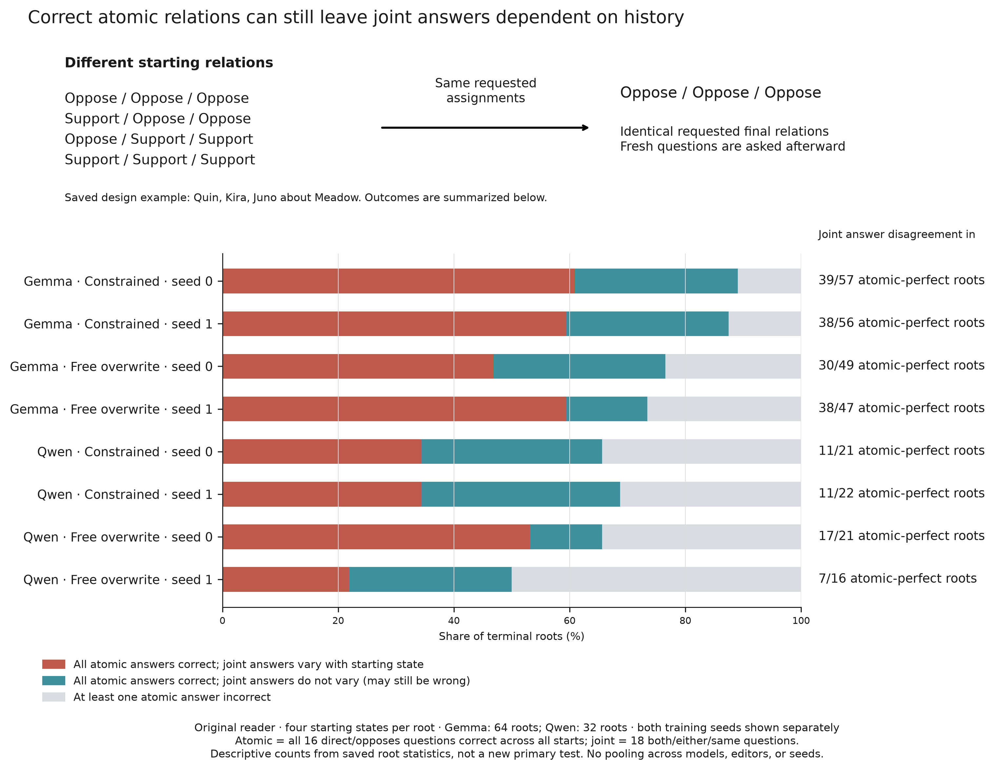

# Figure captions

Methods, measurements, and interpretation for the representation and editing figures.

## Scope

The representation figure set reports development evidence about **decodability**: whether a
linear readout of the model's activations tracks how a consideration bears on an
action. All five figures agree across Llama and Gemma.

That agreement is real for this question, and it stops here. Later causal and
reliability results do not replicate symmetrically across studies. Qualification
failures and bounded positive outcomes differ by experiment; the
[results page](../docs/RESULTS_AND_CLAIMS.md) keeps their scopes separate.

## Shared definitions

**The checkerboard.** A checkerboard crosses two situations with two
considerations. Each consideration flips between Supports and Opposes across the
two situations, so a preference for one situation or one consideration cancels.

**Checkerboard interaction $I_b$.** Each scorer is standardized using a mean and
standard deviation frozen on the pilot select split. The four standardized cell
scores are then combined:

```math
I_b = \tilde{s}_{11} - \tilde{s}_{12} - \tilde{s}_{21} + \tilde{s}_{22}.
```

Any score that is additive in situation and consideration gives $I_b = 0$
exactly. The measure therefore responds only to the situation-by-consideration
interaction. It is a standardized difference-in-differences,
expressed in selection-split standard deviations. Reported values are the mean
over the evaluation checkerboards.

**Splits.** Probes are fitted on the pilot train split, which has 1,500 rows. The
layer and the standardization constants are chosen on the pilot select split,
which has 300 rows across 75 checkerboards. Every reported metric is computed on
the pilot evaluation split, which has 500 rows across 125 checkerboards.

The evaluation split did not participate in choosing the layer. No panel in this
set touches the audited confirmatory boards or the 7,394-row strict test set.
Every figure is development evidence.

**Confidence intervals.** Intervals on M1 checkerboard interaction estimates are
95% *normal* intervals built from the frozen dyadic-robust standard error. They
are not bootstrap intervals. Figure 4 is the one exception: its intervals are
group bootstrap intervals.

---

## Figure 1 — Decodability across layers

A support/opposition direction is fitted independently at every layer, and each
layer is then scored on the evaluation split. Panels **(a, b)** show the
checkerboard interaction. Panels **(c, d)** show AUROC as the secondary
quantity. The left column is Llama-3.1-8B-Instruct, which has 32 layers; the
right column is Gemma-2-9B-it, which has 42. Rows share a y-axis, so the two
models can be compared directly.

Both models sit at chance through the early layers and then rise to a plateau.
The rise falls around layers 10 to 15 in Llama. In Gemma it comes later, around
layers 17 to 25.

The dashed red line marks the frozen layer used in every later figure. That layer
was chosen on the pilot select split, using the prespecified criterion
`mean_mirrored_pairwise`, before the evaluation split was scored.

The selected layer is demonstrably not the peak of the plotted curves.

In Llama, both curves peak at layer 21. There the AUROC is 0.7348 and the
checkerboard interaction is 1.6528. The selected layer 19 gives 0.7320 and
1.6470 instead.

In Gemma, both curves peak at layer 28, at 0.8306 and 2.3366. The selected layer
27 gives 0.8291 and 2.3221.

In each model the selection rule gave up a little of the plotted quantity
relative to that quantity's own maximum. That is what selection on a separate
split should look like. The curves are development-split evaluation metrics,
plotted to show shape, and they had no part in choosing the layer.

## Figure 2 — Scorers at the selected layer

Four scorers are compared at the selected layer: the model answer margin, the
support/opposition direction, the logistic activation probe, and the frozen
MiniLM comparator. Panel **(a)** is Llama at layer 19 and panel **(b)** is Gemma
at layer 27. Error bars are 95% normal intervals from the dyadic-robust standard
error.

The frozen MiniLM comparator sees the situation and the consideration as text and
never sees activations. It reaches a checkerboard interaction of 0.28. That is
small, but it is not zero, so wording alone carries a little interaction signal.

The preregistered gate is therefore stated as a margin over that comparator,
rather than as a claim that the comparator scores nothing. The support/opposition
direction exceeds the comparator by 1.363, with an interval of 1.089 to 1.637, in
Llama. In Gemma it exceeds the comparator by 2.038, with an interval of 1.661 to
2.415. Both intervals exclude zero. Both runs record this as one of the four
gates the frozen direction cleared.

Scorer colours and ordering are held fixed across every figure in this set.

## Figure 3 — Checkerboard interaction against the permutation null

The grey histogram is the null distribution of the checkerboard interaction, and
the coloured line is the observed value. Panels **(a, c)** are Llama and panels
**(b, d)** are Gemma. The top row is the support/opposition direction and the
bottom row is the logistic activation probe. All four panels use one common bin
grid and a density y-axis, because the number of draws differs between the
columns and raw counts would not be comparable.

**How the null is built.** Each draw visits every training situation
independently and either keeps or reverses all of that situation's labels. Llama
has 1,454 training situations across its 1,500 training rows. The draw preserves
the rows themselves, the grouping into situations, and the label composition
within each situation. What it randomizes is the orientation that the support/opposition
direction can learn.

Both probes are then refit from scratch on the flipped training labels. The
select split refits its own standardization constants for that draw. The
checkerboard interaction is recomputed on the 125 held-out evaluation boards.

**How the p-value is defined.** The reported value is a one-sided empirical
permutation p-value, $(k+1)/(B+1)$, where $k$ counts draws at or above the
observed value. This is the prespecified test in both the original run and the
re-run. A two-sided version of the same 10,000 draws gives 0.0245 for the Llama
support/opposition direction, so the conclusion does not turn on sidedness.

**The Llama panels show the later refit-null analysis.** They use 10,000 draws
with the procedure described above. The historical source summary used 200 draws
for improvement over the text comparator, and both Llama probes reported 0.005,
the resolution floor. That historical test and the later refitted-interaction
null are not interchangeable; the change cannot be interpreted simply as a more
precise estimate of the same tail. In the later analysis, the logistic activation
probe gives 0.0001 with no draw reaching the observed value. The support/opposition
direction gives 0.0132, with 131 draws at or above it. Both are below 0.05.

**The Gemma panels are still at 200 draws.** That is low resolution, but it is not
uniformly censored. Only Gemma's logistic result sits at the floor of 1/201.
Gemma's support/opposition direction has 2 draws at or above the observed value,
giving a measured 0.0149. Gemma was not re-run because its layer-27 activations
were not retained.

**Why the two rows differ.** The support/opposition direction's null has a
standard deviation of 1.01, with 46% of draws beyond an absolute interaction of
1, and it is visibly bimodal. The logistic probe's null has a standard deviation
of 0.46, with 2.5% of draws beyond that threshold, and is unimodal near zero.

The consequence is that the support/opposition direction gives the weaker of the
two permutation tests, even though its point estimate is comparable. Read the
logistic panels as the sharper evidence. This experiment does not isolate why the
two nulls differ; regularization is one plausible contributor, but it is not
separated here from the other differences between the estimators.

## Figure 4 — Factual True/False positive control

This control applies the same extraction and direction-fitting machinery to a
task whose ground truth is already known, using the `cities` and `neg_cities`
sources. It acts as a gate: the M1 runner requires each model to pass its own
truth control before the relation result is reported.

Panel **(a)** is the development layer sweep under both answer mappings. Panel
**(b)** is the held-out test, with 95% group bootstrap intervals over 2,000
replicates.

The standardized separation $T$ is a True-minus-False mean difference measured in
training-projection standard deviations, averaged over eight training partitions.
Its scale is therefore set by the training projections themselves.

An earlier version of this control failed strict review. The probe there was
reading the answer token rather than the semantics. The symptom was a
reversed-instruction AUROC of 0.0003 while the reversed-*literal*
True-minus-False AUROC stayed at 0.9997.

The version shown here uses neutral symbols whose meaning is reversed across
examples, and it tests transfer to a held-out answer format. In panel **(a)**,
the standard and reversed mappings diverge after roughly the selected layer 14.
That divergence is the residue of the confound the redesign was meant to remove.

The Gemma point is drawn as an open marker at layer 25 because only its point
estimate was retained. No interval is available for it.

## Figure 5 — Specificity

Each panel places the relation effect beside its controls, in the same units and
on the same axis. Panel **(a)** is Llama at layer 19 and panel **(b)** is Gemma
at layer 27. The rows are grouped into three bands.

**Relation.** The first band holds the fitted support/opposition direction, and
the same frozen direction evaluated under a held-out answer template. The
template result is 2.16 in Llama and 2.26 in Gemma, drawn as an open marker
because no interval was retained. The effect therefore survives a change of
answer format, which is the control against a scorer that is really reading the
answer token or the surface form of the prompt.

**Confound baselines.** The second band holds the frozen MiniLM comparator and
the deterministic random item scores. The comparator reaches 0.28 and the random
item scores reach -0.26. Both are empirical: they are what the estimator returns
for wording alone, and for a meaningless per-item score.

The random baseline needs care in description. Its implementation hashes each
item identifier to a scalar in the range 0 to 1 and scores the item with that
number. No vector in activation space is ever sampled, so this baseline says
nothing about arbitrary directions in the residual stream.

**Zero by construction.** The third band holds situation-only activations,
consideration-only activations, and an additive separate encoding. All three give
an interaction of exactly 0, analytically, because the checkerboard interaction
annihilates any score that is additive in situation and consideration. These rows
are not evidence about the model. They are a validity check that the estimator
behaves as the algebra says, and they are kept in a separate band for that
reason.

**What this figure does not cover.** Two gaps remain, and both need runs outside
M1. Specificity against other semantic directions, such as truth, sentiment, or
actor identity, is not testable here, because M1 fits only the relation
direction; that comparison belongs to the later intervention work. Specificity
against arbitrary activation-space directions is not supplied either, because M1
contains no such control.

So the figure establishes that the effect is not wording, not answer format, and
not an artefact of the board algebra. It does not establish that an arbitrary
direction in the residual stream would fail to produce it.

## Figure 6 — Direct answers and broader counterfactual consequences



The matched Gemma comparison uses the same 96 final worlds at target fraction
0.75. Rank-one relation steering and whole-state interpolation reach the requested
direct-answer margin within tolerance in 100% of these worlds. This is a margin
criterion, not perfect hard-answer accuracy or a full strong-target pass: some
targets fall below the frozen absolute-strength requirement. The direction fitted
to the matched setting also failed qualification; the displayed rank-one arm uses
the original frozen direction.

The right panel measures recovery of the natural change on held-out questions,
including complementary, paraphrased, and unchanged relations. Recovery is a
normalized score, not a proportion of correct answers; zero is the unchanged
starting state and one is the natural change. Negative recovery moves farther
from the natural pattern. Error bars are the saved 95% world-bootstrap intervals.
The natural changed-state patch is a reference intervention, not margin-tuned.
Llama failed natural-reference qualification and is not included in this comparison.

[Saved results](../reproducibility/representation/counterfactual_fidelity/results.json),
[per-world measurements](../reproducibility/representation/counterfactual_fidelity/scores/final_gemma.jsonl.gz),
and [plot data](../artifacts/figures/consequence_comparisons.json) retain the exact
estimates. The supported table replay checks the behavioral measurements; it does
not recreate the omitted fitted direction or later-layer witness.

## Figure 7 — Joint answers retain overwritten source history



This is the earlier V6 descriptive source-history figure, not the V10 prospective
confirmation. The latter is reported separately in
[Results and Claims](../docs/RESULTS_AND_CLAIMS.md#v10-prospective-confirmation).

The top panel shows a saved synthetic design: 4 starting states receive the same
requested final assignments before fresh questions are supplied. The lower panel
uses every terminal root under the original reader: Gemma has 64 roots and Qwen
32, with both editors and both original training seeds shown separately.

A root is atomic-perfect only when all 16 direct/opposes questions are correct
across every starting state. The red segment counts such roots where at least
one of the 18 joint both/either/same questions still changes its answer with the
overwritten starting values. The teal segment has correct atomic answers and no
joint disagreement; its joint answers may still be consistently wrong. Gray
marks roots with at least one incorrect atomic answer. The right-hand counts
use atomic-perfect roots as their denominator; the bars use all roots.

These are descriptive counts derived from saved per-root sufficient statistics,
not a new primary test, an uncertainty interval, or a pooled model/seed estimate.
They isolate observed answer disagreements, not a claim about an identified
internal mechanism. The top panel is a design example, not a sequence of model answers.

[Root statistics](../reproducibility/relational_editing/v6/scores/source_root_statistics.json.gz),
[synthetic source worlds](../reproducibility/relational_editing/v6/data/gemma_source_roots.jsonl),
and [plot data](../artifacts/figures/consequence_comparisons.json) provide the
population and exact counts. Both new figures regenerate through
`python -m repro figures` using [the plotting code](../src/repro/consequence_figures.py).

## Supplementary Figure S1 — Broader single-edit training and later sequences


This is a matched comparison within the coverage study, not a trend across studies.
Both editors were trained on individual edits; the broader condition was trained
on more consequences of each edit. The evaluation asks whether all questions about
the resulting program are correct after two or three updates, averaging those two
outcomes within each scene. Reversed orders are not counted as additional scenes.

The constrained editor limits changes to preserve other addressed relations; free
overwrite is the less restricted comparison. Each row shows broader minus narrower
training for the same editor and model. Positive values favor broader training.
The dot and interval average both training seeds within each scene. The triangles
show the separate seed effects, not extra independent observations.

Intervals are the saved 98.75% paired whole-scene bootstrap intervals. Gemma has
64 scenes and Qwen 32. Three intervals exclude zero in favor of broader training;
Gemma's free-overwrite interval crosses zero. This relative improvement does not
establish a pass of the full absolute joint-control requirements.

The [original comparison table](../reproducibility/relational_editing/v4/expected/T10_coverage_contrasts.csv)
contains the estimates, all seed-specific intervals, and the other study contrasts.
The [plot data](../artifacts/figures/editing_comparisons.json) retain the selected
values without recomputing uncertainty.

## Supplementary Figure S2 — Changing how the same edited state is queried


Each row compares an alternative question with the original question on the same
saved edited states. The paraphrase asks whether two people hold matching positions.
The explicit-rule version adds an explanation: the answer is yes if both support
or both oppose the proposal, and no otherwise. That extra instruction changes the
readout interface; it is not evidence of better answers under the original wording.

The endpoint is same-side question accuracy after a three-edit sequence, averaged
within each scene and then across the two original training seeds. The panel uses
the study's fixed early ordering. Intervals are the saved 99.375% paired whole-scene
bootstrap intervals. Gemma has 64 scenes and Qwen 32. Seed effects are shown
separately, and neither model nor study populations are pooled.

None of these corrected intervals establishes an improvement. Several are wholly
negative; the others cross zero, which is not evidence of equivalence. This
comparison is distinct from the full source-independence test: a change in
question accuracy does not show that overwritten starting relations have ceased
to affect the answers.

The [paired scene records](../reproducibility/relational_editing/v6/scores/reader_paired_contrasts.json.gz),
[exact reader prompts](../reproducibility/relational_editing/v6/data/READERS.json),
and [plot data](../artifacts/figures/editing_comparisons.json) give the full comparisons.
