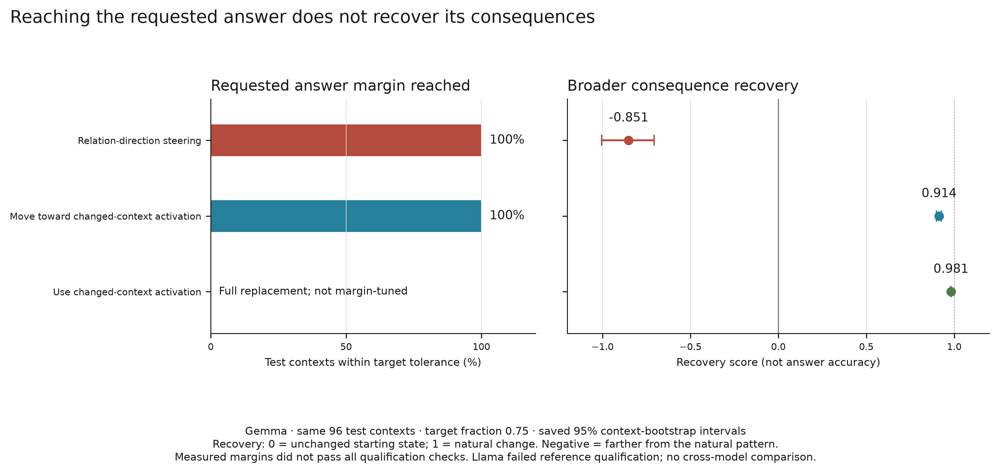
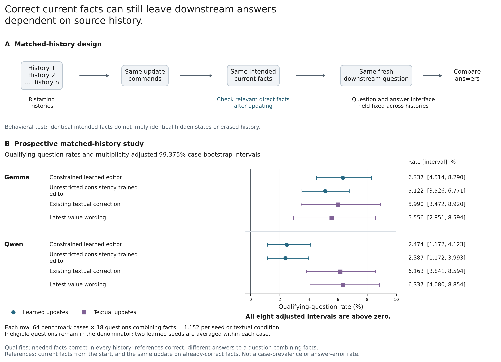
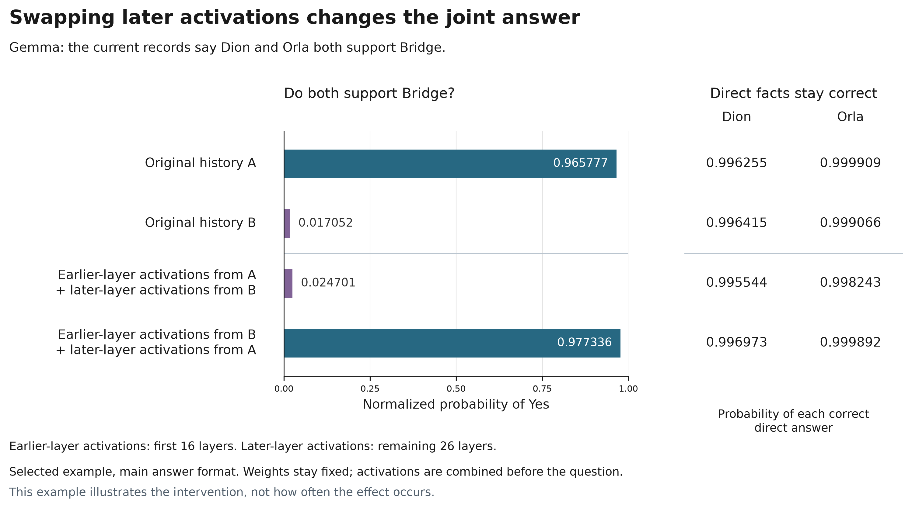
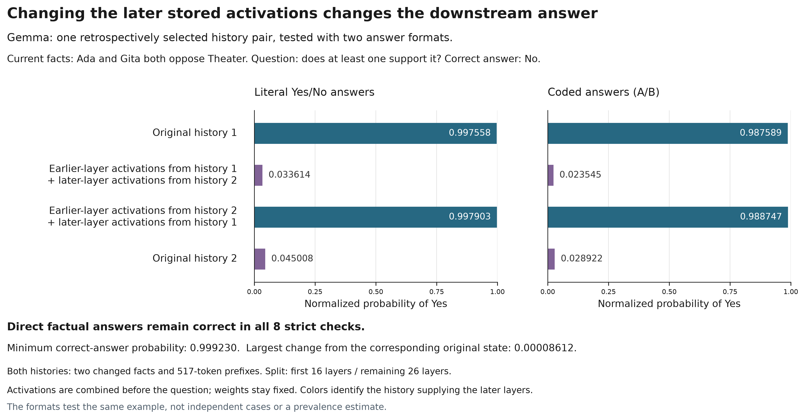
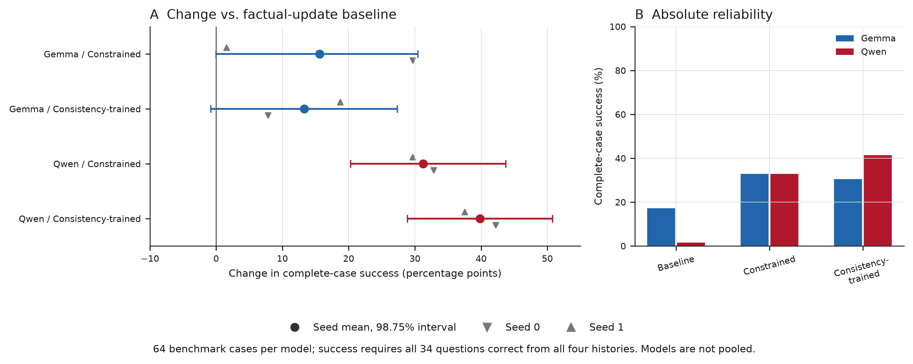
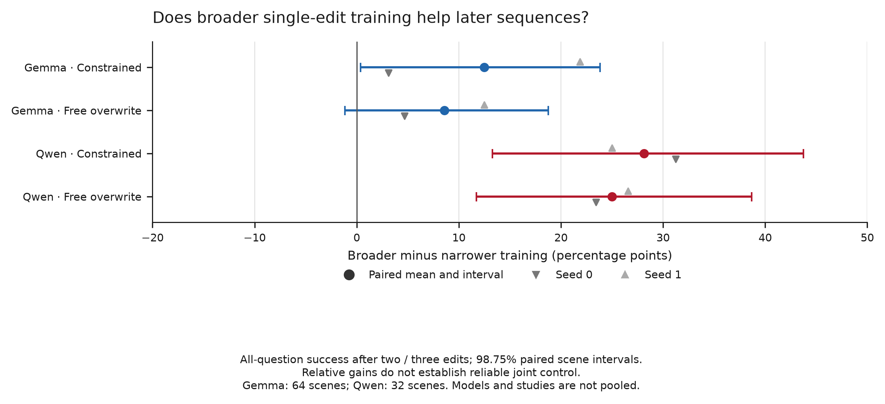
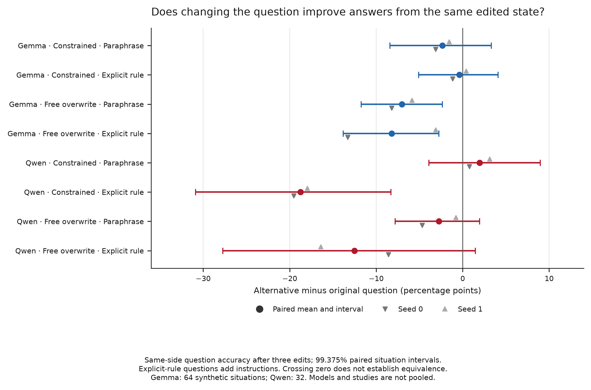

# Figure methods and evidence appendix

Technical companion to the [main-paper captions](CAPTIONS.md). The detailed
accounts below preserve the numerical results, statistical procedures, claim
boundaries, and artifact links; they are not intended as main-paper captions.

## Scope

The five representation figures report development evidence about **decodability**:
whether a linear readout of the model's activations tracks how a consideration
bears on an action.
The representation findings agree across Llama and Gemma. Later causal and
reliability results do not replicate symmetrically across studies. Qualification
failures and bounded positive outcomes differ by experiment; the
[results page](../docs/RESULTS_AND_CLAIMS.md) keeps their scopes separate.

## Shared definitions

**The checkerboard.** Two situations are crossed with two considerations, chosen
so that each consideration supports the action in one situation and opposes it
in the other. This tests the relation between the two, rather than a fixed
preference for either a situation or a consideration.

**Checkerboard interaction $I_b$.** Higher positive values mean stronger
context-sensitive separation. Each scorer is standardized using a mean and
standard deviation frozen on the pilot select split; the four cell scores are
combined as:

```math
I_b = \tilde{s}_{11} - \tilde{s}_{12} - \tilde{s}_{21} + \tilde{s}_{22}.
```

This standardized difference-in-differences is expressed in
selection-split standard deviations and averaged over evaluation checkerboards. Any score
additive in situation and consideration gives $I_b = 0$ exactly.

**Splits.** Relation probes are fitted on the pilot train split (1,500 rows).
Layer selection and standardization use the pilot select split (300 rows across
75 checkerboards); reported metrics use the pilot evaluation split (500 rows
across 125 checkerboards). The evaluation split did not participate in choosing
the layer. These relation figures do not use the audited
confirmatory boards or the 7,394-row strict test set; they remain development
evidence. Figure 4 uses the separate factual-control splits.

**Confidence intervals.** The representation study's (M1) checkerboard
interaction intervals are 95% *normal* intervals using frozen dyadic-robust
standard errors. They are not bootstrap intervals. Figure 4 instead uses
group-bootstrap intervals. The [representation plot data](../artifacts/figures/figure_data.json)
retain the estimates and their source provenance.

---

## Figure 1: Decodability across layers

<a id="figure-1--decodability-across-layers"></a>

Where in the model can we read whether a consideration supports or opposes an
action in context? We fit a separate linear direction at each layer and evaluate
each on the same held-out checkerboards, which cancel fixed preferences for
situations or considerations. Both models move from chance-level early readouts
to a later plateau, with the rise around layers 10 to 15 in Llama and 17 to 25
in Gemma.

Panels **(a, b)** show checkerboard interaction; **(c, d)** show AUROC as a
secondary measure. The left column is Llama-3.1-8B-Instruct (32 layers), and the
right is Gemma-2-9B-it (42 layers). Each row shares a y-axis across models.

The dashed red lines mark the relation layers frozen for the subsequent
selected-layer comparisons, not the peaks of these evaluation curves. Llama's
curves peak at layer 21 (AUROC 0.7348; interaction 1.6528), while selected layer
19 gives 0.7320 and 1.6470. Gemma's curves peak at layer 28 (0.8306; 2.3366),
while selected layer 27 gives 0.8291 and 2.3221.

Layer selection used the prespecified mirrored-pair criterion
(`mean_mirrored_pairwise`) on the separate pilot select split before evaluation.
The plotted curves describe development-split performance; they did not choose
the layers and are not confirmatory evidence.

## Figure 2: Scorers at the selected layer

<a id="figure-2--scorers-at-the-selected-layer"></a>

Does the activation readout capture more of the contextual relation than wording
alone? On the same evaluation checkerboards, we compare two activation readouts,
the model's answer margin, and a frozen text-only comparator. The support/opposition
direction exceeds the text comparator in both models, with both difference
intervals above zero.

Panel **(a)** shows Llama at layer 19; **(b)** shows Gemma at layer 27. The four
scorers are the model answer margin, support/opposition direction, logistic
activation probe, and frozen MiniLM text comparator. MiniLM sees the situation
and consideration but no model activations; its interaction is 0.28, so wording
alone carries a small, nonzero signal.

The direction-minus-comparator difference is 1.363 [1.089, 1.637] in Llama and
2.038 [1.661, 2.415] in Gemma. Error bars and these difference intervals are 95%
normal intervals using dyadic-robust standard errors. The preregistered gate
therefore tests a margin over the comparator, not a zero text signal; both
runs record it as one of four gates passed by the frozen direction. These remain
development results. Scorer colors and ordering are fixed across the
representation figures.

## Figure 3: Checkerboard interaction against the permutation null

<a id="figure-3--checkerboard-interaction-against-the-permutation-null"></a>

Could the measured relation signal arise after randomizing which orientation
counts as support versus opposition? We keep the training examples and their
situation groups fixed, randomly reverse all labels within selected situations,
and refit the readouts before evaluating on the unchanged checkerboards. All four
tests give one-sided p-values below 0.05, with sharper evidence from the logistic
probe.

Grey histograms show the null distributions; colored lines mark observed values.
Panels **(a, c)** are Llama and **(b, d)** Gemma; the top row is the
support/opposition direction and the bottom row the logistic activation probe.
A shared bin grid and density axis make distributions with different draw
counts comparable.

Each training situation independently keeps or reverses all its labels. This
preserves rows, situation membership, and within-situation label relationships,
not necessarily the counts of each label. Llama has 1,454 training situations
across 1,500 rows. Both probes are refitted; the select split refits its own
standardization constants for each draw. Interaction is then measured on the
125 held-out evaluation boards.
The one-sided empirical p-value is $(k+1)/(B+1)$, where $k$ counts draws at or
above the observed statistic and $B$ is the number of draws.

Llama's later refitted-interaction analysis uses 10,000 draws: the direction
gives p = 0.0132 (131 draws at or above the observed value) and the logistic probe
p = 0.0001 (none).
The direction's two-sided sensitivity is 0.0245. Gemma retains 200 draws:
the direction gives p = 0.0149 (2 draws at or above it), while only the logistic result
is at the resolution floor, 1/201. Gemma was not re-run because its layer-27
activations were not retained.

The historical Llama summary instead tested improvement over the text comparator
with 200 draws; both probes gave 0.005, the resolution floor. Both analyses use
the prespecified one-sided tail rule, but the historical test and later
refitted-interaction null are not interchangeable. The change cannot be interpreted
simply as a more precise estimate of the same tail.

In the later Llama null, the direction has standard deviation 1.01 and 46% of
draws beyond absolute interaction 1, with a bimodal shape. The logistic null is
unimodal near zero, with standard deviation 0.46 and 2.5% beyond that threshold.
These shapes explain why comparable point estimates give different evidence
strengths; the experiment does not isolate their cause. Regularization is a
possible contributor, not an established explanation. The
[saved refit-null analysis](../artifacts/figures/permutation_null_llama_B10000.json)
and [refitting code](../scripts/rerun_permutation_null.py) retain the exact procedure.

## Figure 4: Factual True/False positive control

<a id="figure-4--factual-truefalse-positive-control"></a>

Can the same readout method distinguish statements whose ground truth is known
without merely recognizing an answer token? We keep factual labels fixed and use
neutral symbols whose meaning is reversed across examples, then test transfer
to a held-out answer format. Both models pass this factual control, a gate that
each model must pass before its relation result is reported.

Panel **(a)** shows the development layer sweep under both answer mappings;
**(b)** shows held-out test separation. Separation $T$ is the True-minus-False
mean difference in training-projection standard deviations, averaged over eight
training partitions; its scale is therefore set by those training projections.
Error bars are 95% group-bootstrap intervals from 2,000 replicates. Gemma is an
open marker at layer 25 because only its point estimate,
not an interval, was retained.

The statements come from the `cities` and `neg_cities` sources. An earlier
literal-label control failed: reversed-instruction AUROC was 0.0003 while
reversed-*literal* True-minus-False AUROC remained 0.9997, exposing answer-token
rather than semantic readout. In the redesigned control shown here, the
standard and reversed mappings still diverge after roughly Llama's selected
layer 14, retaining evidence of that confound at later layers. Passing this
control does not validate every layer. The
[current control](../artifacts/truth/v2_results.json) and
[earlier diagnostic](../artifacts/truth/v1_diagnostic.json) remain separate.

## Figure 5: Specificity

<a id="figure-5--specificity"></a>

Could wording, answer format, or the checkerboard calculation explain the
relation effect? Holding the evaluation checkerboards and measurement scale
fixed, we compare the learned direction with a new answer format, text-only and
random-item scores, and scores built from each input separately. The relation
effect survives the answer-format change and exceeds these empirical baselines;
the separate-input controls are zero by construction, not independent evidence
about the model.

Panel **(a)** shows Llama at layer 19 and **(b)** Gemma at layer 27, with three
bands on the same axis. The **relation** band contains the fitted direction and
its frozen transfer to a held-out answer template: interaction 2.16 in Llama and
2.26 in Gemma. This tests whether the scorer is reading the answer token or
prompt surface form. Open markers indicate that no transfer intervals were retained.

The **confound-baseline** band shows MiniLM text scores (0.28) and deterministic
random item scores (-0.26). Its implementation hashes each
item identifier to a scalar in the range 0 to 1 and scores the item with that
number. No vector in activation space is ever sampled. The **zero by construction**
band contains situation-only activations, consideration-only
activations, and additive separate encodings. All give interaction 0 analytically
because the checkerboard contrast cancels additive scores. Their separate band
marks an algebraic validity check, not a neural finding.

Thus the measured effect is not wording alone as captured by the tested baseline,
and survives the tested format change. This study fits only the relation direction:
it does not compare other semantic directions (truth, sentiment, or actor identity), or establish
that arbitrary residual-stream directions would fail. Semantic-direction
comparisons belong to the later intervention work.

## Figure 6: Direct answers and broader counterfactual consequences

<a id="figure-6--direct-answers-and-broader-counterfactual-consequences"></a>



Does making the model give the targeted direct answer reproduce the consequences
of actually changing a fact? On the same Gemma contexts, we compare steering
along the relation direction with moving the whole activation toward a context
whose relation has genuinely changed, tuning both to the same direct-answer
target. Both reach that target, but only the whole-state intervention closely
recovers the changed context's answers to other questions; relation steering
moves those answers farther from the natural pattern.

The left panel shows direct-answer margin attainment in the same 96 final worlds
at target fraction 0.75: both tuned interventions hit the requested
margin within tolerance in 100% of worlds. The right panel shows recovery on
held-out complementary, paraphrased, and unchanged-relation questions. The
natural changed-state patch replaces the activation with that of the changed
context and is a reference intervention, not margin-tuned.

Recovery is a normalized score, not a proportion of correct answers: zero is the
unchanged starting state and one the natural change. Negative recovery moves farther
from that pattern. Error bars are the saved 95% world-bootstrap intervals. Likewise,
a margin hit measures relative answer preference,
not perfect hard-answer accuracy or a full strong-target pass: some targets fall below the frozen
absolute-strength requirement. The direction fitted to the matched setting
failed qualification, so the plotted steering arm uses the original frozen
direction. Llama failed natural-reference qualification and is not included.

[Saved results](../reproducibility/representation/counterfactual_fidelity/results.json),
[per-world measurements](../reproducibility/representation/counterfactual_fidelity/scores/final_gemma.jsonl.gz),
and [plot data](../artifacts/figures/consequence_comparisons.json) retain the exact
estimates. Table replay checks the behavioral measurements, not the omitted
fitted direction or later-layer witness.

## Figure 7: Correct current facts can still leave downstream answers dependent on source history

<a id="figure-7--correct-current-facts-can-still-leave-downstream-answers-dependent-on-source-history"></a>



Different starting histories receive the same updates and reach the same
intended current facts. After verifying the relevant facts directly, we ask the
same downstream question with the same response interface across histories.
The figure measures how often the answer still changes with the overwritten
history despite correct direct fact reports and reference answers. This pattern
recurs in both models under learned and textual updates, with all eight adjusted
intervals above zero.

**Panel A** shows the matched-history design: all 8 starting assignments to
three addressed records lead to the same complete intended final table, including
untouched facts. **Panel B, prospective V10 aggregate result,** shows Gemma and Qwen
under a constrained learned editor, an unrestricted consistency-trained editor,
an existing textual correction, and latest-value wording. Dots and squares
distinguish learned and textual updates, not a ranking of methods.

A counted case (a *primary witness*) requires both direct operands correct and
valid in every history, correct native-final and same-method no-op references,
and differing valid joint hard answers across histories. Here, operands are the
two facts needed for the joint question; the no-op reference applies the same
method to an already-correct state.
Each plotted cell has 64 case designs (*roots*) and 18 fixed joint-question
opportunities per root: 9 semantic questions under two answer-code draws, or
1,152 opportunities per learned seed or textual condition.
Ineligible questions remain in the denominator.

Points copy the saved primary mean root witness rates. The
two learned-seed scores are averaged within each root before averaging roots;
models and update groups are not pooled.
Intervals are the saved multiplicity-adjusted 99.375% root-bootstrap intervals
from 10,000 draws, correcting across 8 cells. All eight intervals lie above zero.
The rate is not root prevalence, a rate conditional on passing the filters,
or an individual-answer error rate.
The intervals support recurrence within the generated-case sampling scheme,
not universal failure or pairwise method differences.

This is behavioral source-history dependence despite protected factual readout.
It does not establish that updated facts are absent internally, that
separate physical old/new stores exist, or that a specific neural mechanism is identified;
neither equality of hidden activations nor physical erasure of history is assumed.
Correct facts with a history-sensitive reader remain possible.

The selected Qwen Wren/Orla
[illustrative repeat-checked witness](../reproducibility/state_sufficiency/independent_verification/examples/EXAMPLES.md#repeat_checked_positive)
is separate from the aggregate: direct facts are correct across histories, but
the fixed same-side question gets different answers. That exact joint query
matches both fresh repeat passes. Operand scores are from the core, not all
independently repeated. It is not a prevalence estimate. The
[main-text account](../docs/RESULTS_AND_CLAIMS.md#a-repeat-checked-illustration-and-provenance-limits)
and [saved example](../reproducibility/state_sufficiency/v10/selected_repeat_checked_example.json)
retain these limits.

For reproduction, the method identifiers are `INV_PAIR_NLL`,
`FREE_PAIR_CONSISTENCY`, `EXISTING_CORRECTION`, and
`LATEST_SAME_WORDING`, respectively; the bootstrap seed is 2609141002.
[Saved primary output](../reproducibility/state_sufficiency/v10/primary_results.json),
[specification](../reproducibility/state_sufficiency/v10/specification_summary.json),
and [full-precision plot data](../artifacts/figures/v10_source_history.json)
bind every plotted estimate and interval. The
[plotting code](../src/repro/source_history_figure.py), invoked with
`python -m repro figures`, performs no new inference, estimand, or uncertainty
calculation. The earlier V6 figure remains
[Supplementary Figure S3](#supplementary-figure-s3--v6-descriptivearchival-source-history-census),
not prospective confirmation.

## Figure 8: Swapping later activations changes the joint answer

<a id="figure-8--swapping-later-activations-changes-the-joint-answer"></a>



Can changing stored activations change which old history controls a later
answer, while the current facts and question stay fixed? In this selected Gemma
example, both histories end with Dion and Orla supporting Bridge, yet give very
different answers to whether both support it. Swapping the later layers' stored
activations before asking the question shifts the joint answer toward the history
supplying those activations, while direct fact answers remain correct.

Bars show normalized probability of semantic Yes under the main answer format;
adjacent columns show probabilities of the two correct direct answers, both near
one. The swap combines the first 16 layers from one history with the remaining
26 from the other. The activations are combined before the question;
model weights stay fixed. Bar widths use unrounded saved-score values; labels
show six decimal places. Colors identify the later-activation donor, not correctness.

This is one selected example, not a prevalence estimate. Across six selected
cases, the main format gives five clear later-state effects and one mixed result;
the alternate format gives one clear effect, two mixed results and three cases
with insufficient original separation. The swap establishes coarse causal
influence, not a unique mechanism or where the history information first arose.

[Unrounded plot data](../artifacts/figures/cache_crossover.json),
[the six-case table](../reproducibility/cache_crossover/six_cases.csv), and
[saved-score replay and provenance](../reproducibility/cache_crossover/README.md)
identify the example as `SSC1-FINAL-0026`, question
`SSC1-FINAL-0026-d1-extra2`.

## Figure 9 - Changing the later stored activations changes the downstream answer



Does the activation-swap effect survive a change in answer format when the two
histories also match in update count and prompt length?
One retrospectively selected Gemma history pair holds current facts and the downstream question fixed:
Ada and Gita both oppose Theater, so the correct answer to whether at least one
supports it is No. Under both tested formats, swapping later stored activations
changes the joint answer toward the history supplying them, while separately
measured direct facts remain correct.

The two formats show the same pair, whose histories each require 2 fact changes
and have 517-token prefixes. Each swap combines the first 16 layers from one
history with the remaining 26 from the other before the question; model weights
stay fixed. Bars show unrounded normalized probabilities of semantic Yes, with
labels rounded to six decimal places. Colors identify the later-layer donor,
not correctness. The coded format maps answer tokens back to semantic Yes/No
separately for each question.

All 8 strict direct-fact checks pass: minimum correct-answer probability is
0.999230 and maximum change from the corresponding original later-donor state
is 0.00008612. The two formats test the same example, not independent cases or a
prevalence estimate. The intervention swaps a large block of stored computation.
Earlier computation may have contributed to it, so a unique circuit or stored
obsolete fact remains unidentified.

[Source tables](../artifacts/cache_crossover/extension_joint.csv),
[direct checks](../artifacts/cache_crossover/extension_direct.csv),
[plot data](../artifacts/figures/cache_crossover_extension.json), and
[replay and provenance](../reproducibility/cache_crossover/README.md#one-case-extension)
provide full values. The original six-case results remain separate in Figure 8
and the [appendix](../docs/CACHE_CROSSOVER_APPENDIX.md).

## Figure 10. Update procedures and downstream coherence



Does the update procedure affect whether a model gets the full set of later
answers right? We compare two learned procedures with fact refresh plus latest
textual correction on the same case designs, each containing four histories
ending at the same facts and the same questions. Both learned procedures improve
complete-case success clearly in Qwen; Gemma's results are mixed, and neither
learned method's seed mean reaches half the roots in either model.

Panel **A** shows percentage-point changes from the baseline: both Qwen intervals
exclude zero, while Gemma's constrained interval touches zero and its
consistency-trained interval crosses zero. Panel **B** shows absolute
complete-root success on the full percentage scale. A case (*root*) succeeds only
if all 34 questions are correct under every one of its four histories; each
model has 64 terminal roots.

Points average both learned seeds within each root; error bars are 98.75% paired
root-bootstrap intervals. Triangles show the separate seed effects, and models
are not pooled. "Constrained" denotes `INV_PAIR_NLL`; "consistency-trained"
denotes `FREE_PAIR_CONSISTENCY`; the baseline identifier is `FIELD_PLUS_LATEST_ERRATUM`.
The baseline used its recorded fallback in 192/256 contexts
per model, so these are comparisons with that executed baseline, not proof of
successful internal fact refresh in every context.

The improvements do not establish a universal consistency cure. They support
evaluating downstream coherence separately from local update quality. This
comparison does not replace the paper's matched-history test of sufficiency
after verifying current facts.

[Saved rows, tables and reconstruction](../reproducibility/update_method_comparison/README.md)
and [plotting code](../src/repro/update_methods_figure.py) reproduce both panels
through `python -m repro figures` without model inference.

## Supplementary Figure S1: Broader single-edit training and later sequences

<a id="supplementary-figure-s1--broader-single-edit-training-and-later-sequences"></a>



Does training on more consequences of individual edits help with later sequences
of edits? We compare broader and narrower training for each editor and model on
the same evaluation scenes, with both editors trained on individual edits.
Three intervals exclude zero in favor of broader training; Gemma's free-overwrite
interval crosses zero.

Each row shows broader minus narrower training: positive values favor broader
coverage. The constrained editor limits changes to preserve other addressed
relations; free overwrite is less restricted. The outcome requires all questions
about the resulting program to be correct after two or three updates, with the
two outcomes averaged within each scene. Reversed orders are not counted as
additional scenes.

Dots and saved 98.75% paired whole-scene bootstrap intervals average both training
seeds within each scene; triangles show separate seed effects, not extra
independent observations.
Gemma has 64 scenes and Qwen 32. This is a matched comparison within the coverage
study, not a trend across studies. This relative improvement does not
establish a pass of the full absolute joint-control requirements.

The [original comparison table](../reproducibility/relational_editing/v4/expected/T10_coverage_contrasts.csv)
contains estimates, seed-specific intervals, and other study contrasts. The
[plot data](../artifacts/figures/editing_comparisons.json) retain the selected
values without recomputing uncertainty.

## Supplementary Figure S2: Changing how the same edited state is queried

<a id="supplementary-figure-s2--changing-how-the-same-edited-state-is-queried"></a>



Can changing the question improve answers without changing the edited state?
Each row compares a paraphrase or an explicit-rule question with the original
question on the same saved edited states after a three-edit sequence.
None of these corrected intervals establishes an improvement. Several are wholly
negative and the others cross zero, which is not evidence of equivalence.

The paraphrase asks whether two people hold matching positions. The explicit-rule
version explains that Yes means both support or both oppose the proposal, and No
means otherwise. That extra instruction changes the readout interface; it is
not evidence of better answers under the original wording.

The endpoint is same-side question accuracy after a three-edit sequence, averaged
within each scene and then across the two original training seeds, using the
study's fixed early ordering. Error bars are the saved 99.375%
paired whole-scene bootstrap intervals; Gemma has 64 scenes and Qwen 32. Seed
effects are shown separately; neither model nor study populations are pooled.
This is distinct from the full source-independence test: a change in question
accuracy does not show that overwritten starting relations have ceased to affect
the answers.

The [paired scene records](../reproducibility/relational_editing/v6/scores/reader_paired_contrasts.json.gz),
[exact reader prompts](../reproducibility/relational_editing/v6/data/READERS.json),
and [plot data](../artifacts/figures/editing_comparisons.json) give the full comparisons.

## Supplementary Figure S3: Descriptive history dependence in archived cases

<a id="supplementary-figure-s3--v6-descriptivearchival-source-history-census"></a>


Can answers to joint questions still depend on old facts when every direct fact
answer is correct? In this archival V6 test, 4 starting states receive the
same requested final assignments and are then asked the same fresh questions.
The red bar segments count cases with correct direct answers across all histories
but at least one joint answer that changes with the overwritten values. These
are descriptive counts, not the prospective V10 confirmation in Figure 7.

The top panel is a design example, not a sequence of model answers.
The lower panel includes every terminal root under the original reader: 64 for
Gemma and 32 for Qwen, with both editors and both original training seeds shown
separately. A root is *atomic-perfect* only when all 16 direct/opposes questions are correct
across every starting state. Red marks such roots with disagreement on
at least one of the 18 joint both/either/same questions; teal marks atomic-perfect
roots without joint disagreement, whose joint answers may still be consistently
wrong. Gray marks roots with an incorrect atomic answer. The right-hand counts
use atomic-perfect roots as their denominator; the bars use all roots.

This is the earlier V6 descriptive source-history figure, not the V10 prospective
confirmation. Previously Figure 7, it preserves the original counts and provenance.
The saved per-root statistics provide descriptive counts, not a new primary test,
uncertainty intervals, or pooled model/seed estimates. They isolate observed answer
disagreements, not a claim about an identified internal mechanism. This census
is distinct from the later fixed-certificate V6 replay.

[Root statistics](../reproducibility/relational_editing/v6/scores/source_root_statistics.json.gz),
[synthetic source worlds](../reproducibility/relational_editing/v6/data/gemma_source_roots.jsonl),
and [unchanged plot data](../artifacts/figures/consequence_comparisons.json) retain
the population and exact counts. The
[archival plotting code](../src/repro/consequence_figures.py) is invoked through
`python -m repro figures`.
